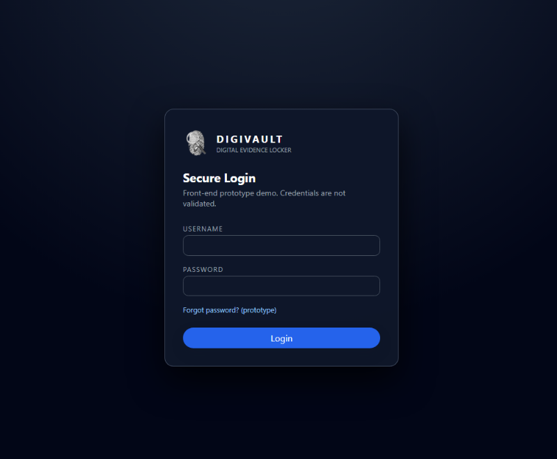
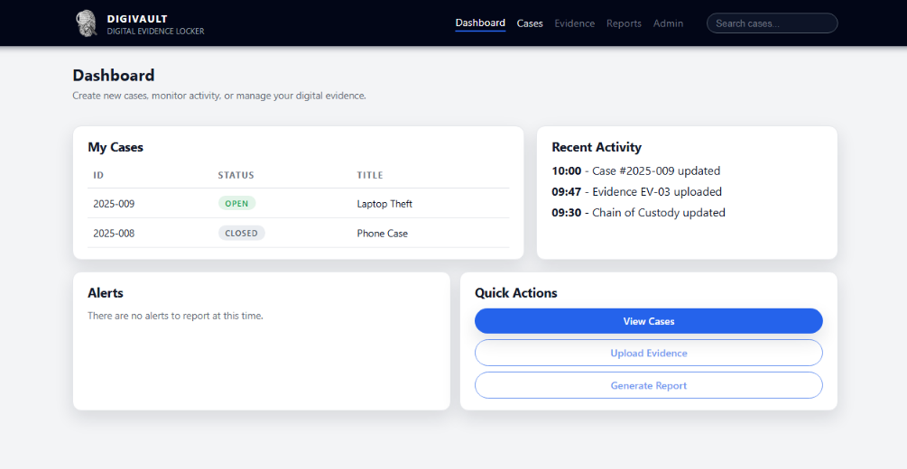
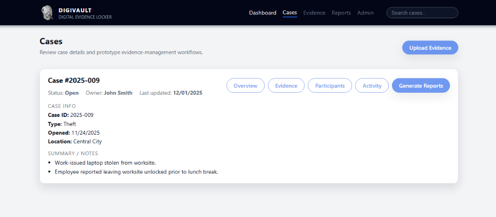

# DigiVault

A responsive front-end prototype for a digital evidence and chain-of-custody management interface.

## Project Overview

DigiVault was created as an academic web-design project to explore how investigators or administrators could interact with a digital evidence management system.

The current repository contains the **front-end prototype only**. It demonstrates interface design and navigation concepts for login, dashboard, and case-management screens. Authentication, evidence uploads, report generation, database storage, and backend services are not implemented.

## Features Demonstrated

- Responsive HTML/CSS interface
- Login screen and prototype navigation flow
- Dashboard with case status and recent activity
- Case-detail screen with metadata and notes
- Reusable navigation, cards, buttons, badges, and responsive layouts
- Accessibility-oriented labels and semantic navigation
- Mobile-responsive layout using CSS media queries

## Pages

- `index.html` — prototype login screen
- `dashboard.html` — dashboard and case activity overview
- `cases.html` — sample case detail page

## Repository Structure

```text
digivault/
├── README.md
├── index.html
├── dashboard.html
├── cases.html
├── styles.css
├── assets/
│   └── digivault-logo.png
└── screenshots/
```

## Running Locally

No build tools are required.

1. Download or clone the repository.
2. Open `index.html` in a web browser.
3. Enter any placeholder username/password and select **Login**.
4. Navigate between the Dashboard and Cases pages.

Because this is a front-end prototype, the login form does not validate credentials.

## Screenshots

### Login



### Dashboard



### Cases



## GitHub Pages

This project can be hosted directly with GitHub Pages because it uses static HTML and CSS.

After enabling GitHub Pages for the repository, the live site will open from `index.html`.

## Skills Demonstrated

`HTML5` `CSS3` `Responsive Web Design` `UI/UX` `Front-End Development` `Semantic HTML` `Web Prototyping`

## Portfolio Notes

The interface represents a proposed digital evidence workflow. Items such as evidence upload, report generation, search, administration, and authentication are intentionally shown as prototype features rather than functional backend capabilities.

## Author

Alejandro Fermin
